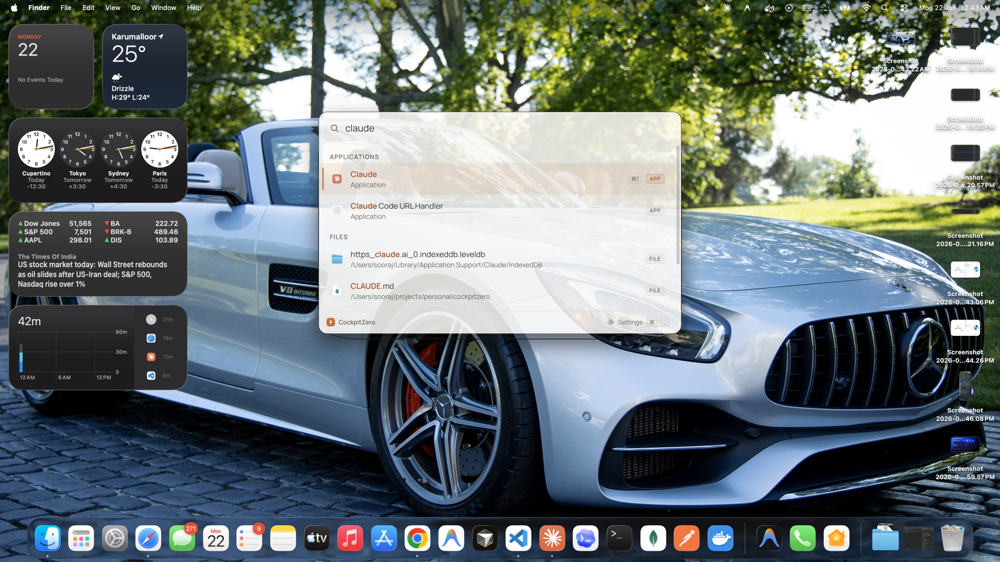
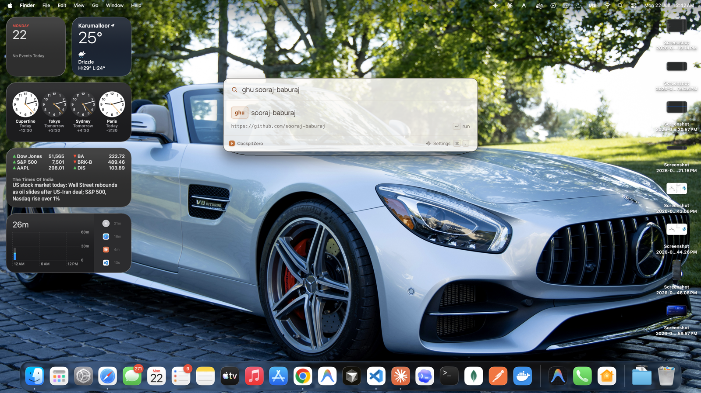
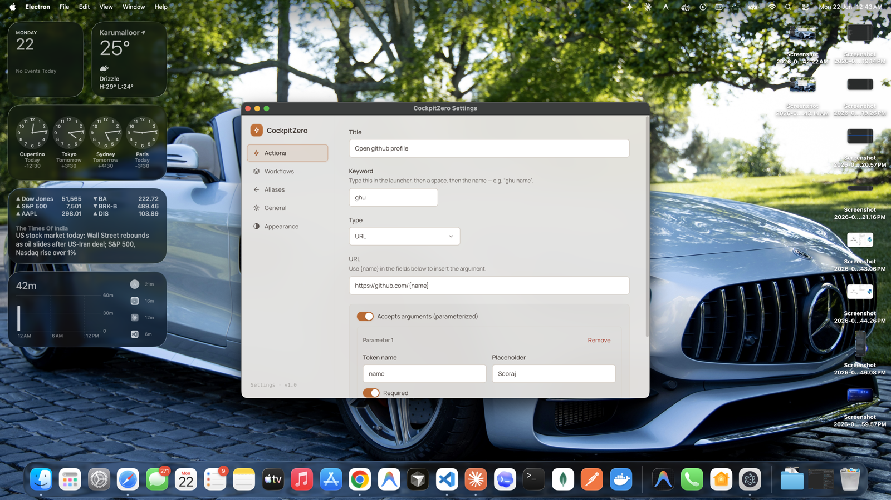
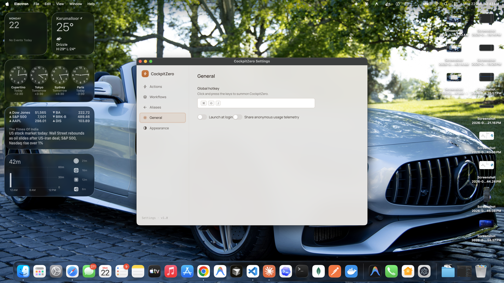

<div align="center">

# ✦ CockpitZero

### Your keyboard's command center.

**A keyboard-first, cross-platform desktop launcher** — summon a frameless command bar with one
hotkey, fuzzy-search everything you've configured _and_ everything on your machine, and run it with
Enter. Spotlight energy, Raycast power, fully yours.

`Cmd / Ctrl + Shift + Space` → type → **Enter**. That's the whole interaction.

<br />

[](https://www.electronjs.org/)
[](https://react.dev/)
[](https://www.typescriptlang.org/)
[](https://tailwindcss.com/)
[](https://turbo.build/)


</div>

---

## 🎬 See it

> 📸 Screenshots live in [`docs/screenshots/`](./docs/screenshots/). Drop the images in (filenames
> are listed there) and these previews light up.

<div align="center">



<br /><br />

<table>
  <tr>
    <td align="center"><br /><sub><b>Parameterized actions</b> — live preview as you type</sub></td>
    <td align="center"><br /><sub><b>System search</b> — apps &amp; files, sectioned</sub></td>
  </tr>
  <tr>
    <td align="center"><br /><sub><b>GUI config</b> — actions, aliases, workflows</sub></td>
    <td align="center"><br /><sub><b>Hotkey</b> — launch at login &amp; share telemetry</sub></td>
  </tr>
</table>

</div>

---

## ✨ What it does today

Everything here is **implemented and working** in this repo.

### 🚀 Launch anything

Four action types cover the daily essentials — and they're a discriminated union, so adding more is
trivial:

| Type          | Does                                  | Example                        |
| ------------- | ------------------------------------- | ------------------------------ |
| `open-url`    | Opens a URL in your browser           | Jump to your dashboard         |
| `open-app`    | Launches an app by name or path       | Open Figma                     |
| `run-command` | Runs a shell command with args        | `git fetch --all`              |
| `snippet`     | Copies / pastes text to the clipboard | Your support email boilerplate |

### 🧩 Parameterized actions — one action, infinite uses

Use `{token}` templates and the launcher captures the rest of your input positionally, with a
**live preview** as you type:

```
g hello world          →  google.com/search?q=hello%20world
npm react              →  npmjs.com/package/react
gh anthropic claude    →  github.com/anthropic/claude   (multi-arg, last one greedy)
```

Tokens that aren't declared are inferred automatically — "tokens imply parameters." URL values are
URL-encoded for you.

### 🔗 Workflows — chain actions into one command

Bundle several actions under a single name and run them in sequence. Open three dashboards and start
your build with one Enter.

### 🔎 System search — apps & files, cross-platform

Type anything that isn't a configured item and CockpitZero also searches your machine:

- **macOS** — `/Applications` + Spotlight (`mdfind`)
- **Windows** — Start Menu + the Search index
- Results are **deduped and grouped into sections**: Actions → Workflows → Applications → Files.

The slow OS index runs on a separate async path, so it **never delays** your instant configured
matches — the bar fires both lookups in parallel and merges them.

### ⚡ Built to feel instant

- **fzf-powered fuzzy ranking** with match highlighting across actions, apps, and files.
- **Frecency** (frequency × recency) floats your most-used items to the top and adapts to your
  habits.
  **favicons** for URL actions, all cached.
- **Path autocomplete** when configuring file/app targets.

### 🎛️ GUI-first config

No config files to hand-edit. A themed settings window manages **actions, aliases, workflows**, the
**global hotkey** (with a recorder), **theme** (System / Light / Dark), and a **frosted-glass**
translucency toggle. Changes persist instantly and the hotkey re-registers on the fly. An optional
backend can sync your config across devices.

---

## 🔭 Where CockpitZero is going

Today it's a launcher. Next, it becomes an **AI cockpit** — a single bar from which you _delegate
work_, not just trigger commands. The short version:

- 🤖 **AI behind the bar** — ask in natural language; the launcher figures out the rest.
- 🛠️ **AI-authored workflows** — describe an outcome, and AI drafts the workflow (actions +
  arguments) for you to edit.
- 🔁 **Routines** — set-and-forget AI jobs. First up: a **unified notification digest** that pulls
  email / Slack / Teams and **summarizes + prioritizes** by importance, so you get one ranked
  briefing instead of five inboxes.
- 🧠 **Memory, history & tools** — persistent context plus a tool layer the AI can act through, to
  absorb daily busywork. E.g. a PM could **summarize a meeting**, **build a presentation**, or
  **fill a spreadsheet** — state the intent, review the result.
- 💎 **A much more efficient UI** to present richer results, still keyboard-first and out of your
  way.

> **📦 Note on distribution:** CockpitZero has been built in the open until now. **Future releases
> will be private.** This repo is the open foundation; the AI-era work ships in private builds.

👉 Full details and stage tracking in **[docs/ROADMAP.md](./docs/ROADMAP.md)**.

---

## 🏁 Quick start

**Prereqs:** Node 22 (`.nvmrc`), pnpm 10 (`corepack enable`).

```bash
corepack enable          # ensure pnpm 10
pnpm install             # install the whole workspace
pnpm dev                 # run desktop + backend + web via Turborepo
```

Then hit **`Cmd / Ctrl + Shift + Space`** to summon the launcher.

### Run an app on its own

| App                | Command                                  | Notes                          |
| ------------------ | ---------------------------------------- | ------------------------------ |
| Desktop (Electron) | `pnpm --filter @cockpitzero/desktop dev` | Hotkey: `Cmd/Ctrl+J`          |
| Backend (Hono)     | `pnpm --filter @cockpitzero/backend dev` | http://localhost:8787          |
| Web (Next.js)      | `pnpm --filter @cockpitzero/web dev`     | http://localhost:3000          |

### Everyday scripts

```bash
pnpm build       # build everything (shared builds first)
pnpm lint        # eslint across all packages
pnpm typecheck   # tsc --noEmit across all packages
pnpm test        # vitest (desktop + backend + shared)
pnpm format      # prettier --write
pnpm changeset   # record a version bump for packages/*
```

---

## 🧱 How it's built

A **Turborepo + pnpm** monorepo. The desktop main process is layered (app / services / infra /
windows / ipc); the renderer follows atomic design. The renderer is **sandboxed and
context-isolated** — it never touches `ipcRenderer` directly. Every main↔renderer call flows
through one typed bridge whose contract lives in `packages/shared`, so the two sides can't drift.

```
apps/
  desktop/   Electron launcher (electron-vite, React, Tailwind v4)
  backend/   Hono API on Node (Drizzle + SQLite, Postgres-swappable) — sync/auth/telemetry
  web/       Next.js 15 marketing + download site
packages/
  shared/         Pure TS — Zod schemas (source of truth), inferred types, IPC contract, utils
  eslint-config/  Shared ESLint 9 flat configs
  tsconfig/       Shared TypeScript base configs
```

**Source of truth:** Zod schemas in `packages/shared` define the config shape; every type is
inferred from them, and every read/write is validated. Apps never import from each other — anything
cross-cutting lives in `shared`.

📐 Deeper dive: **[CLAUDE.md](./CLAUDE.md)** (conventions + how to extend) and
**[docs/ARCHITECTURE.md](./docs/ARCHITECTURE.md)** (layers + data flow).

### What's implemented vs. stubbed

| Area                                  | Status                                                  |
| ------------------------------------- | ------------------------------------------------------- |
| Launcher, actions, parameterized args | ✅ Implemented                                          |
| Workflows (sequential)                | ✅ Implemented                                          |
| System search (macOS + Windows)       | ✅ Implemented · Linux returns empty (unimplemented)    |
| GUI settings, theming, frosted glass  | ✅ Implemented                                          |
| Frecency, native icons, favicons      | ✅ Implemented                                          |
| Backend `/sync` & `/auth`             | 🚧 Shape-validated stubs (no real persistence/auth yet) |
| electron-builder packaging            | 🚧 Scaffolded, not a current focus                      |
| The AI cockpit (see roadmap)          | 🔮 Future — and private                                 |

---

<div align="center">

Built keyboard-first. ⌨️

</div>
