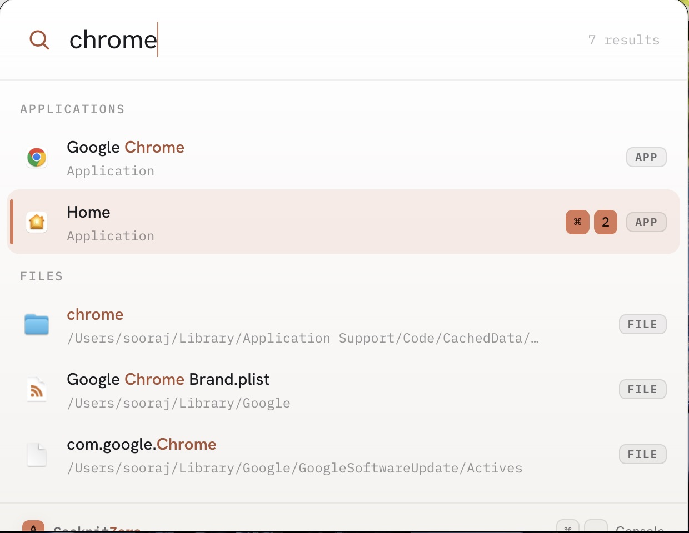
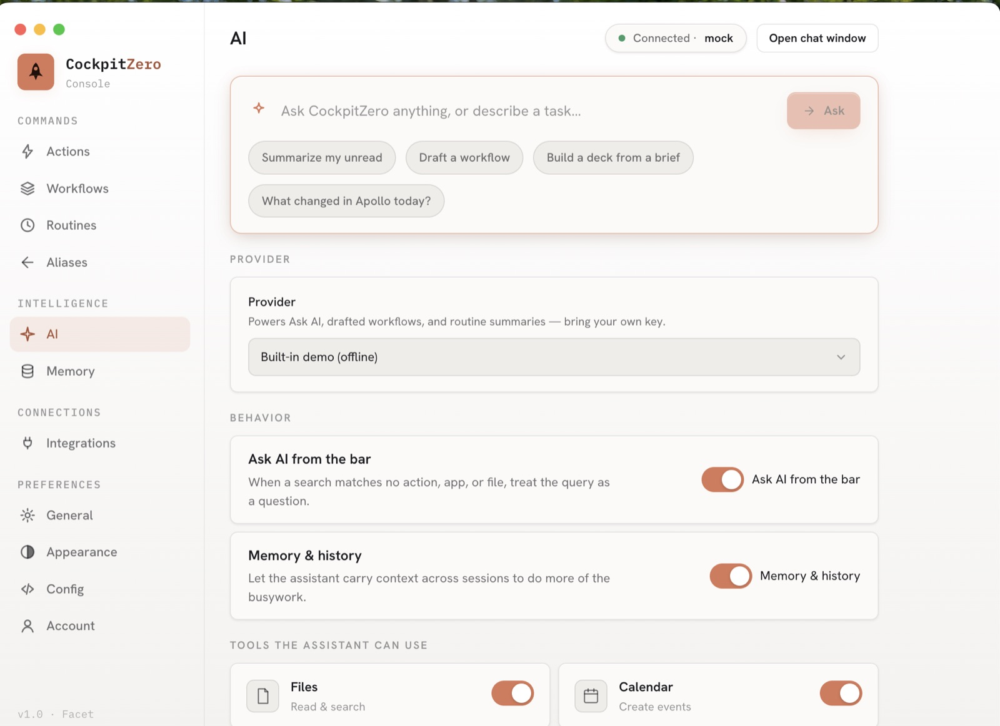
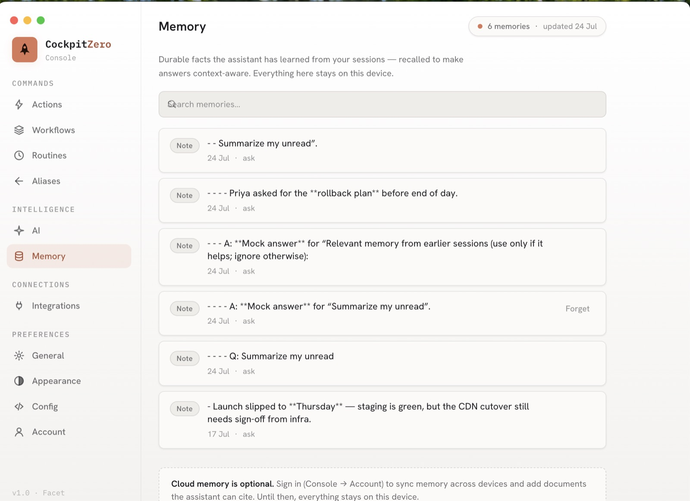
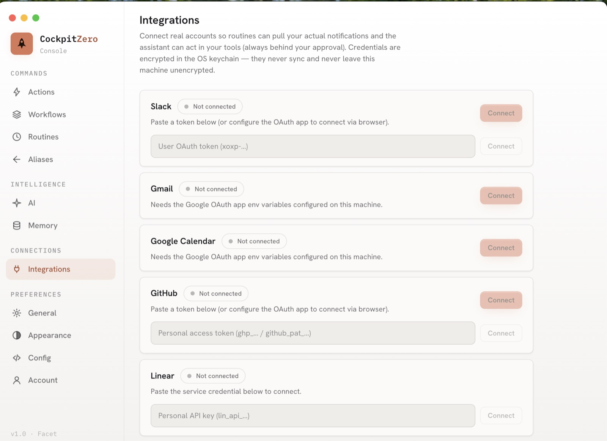
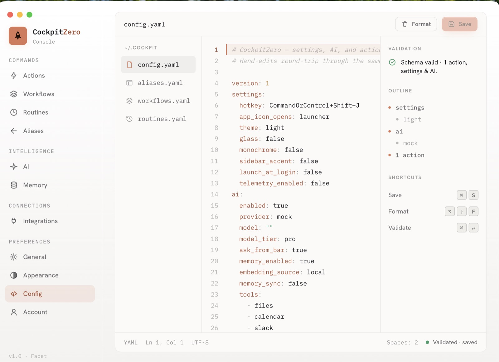
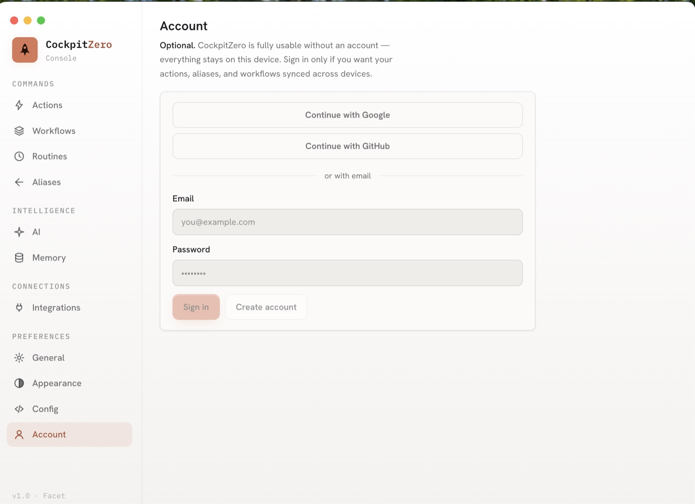

<div align="center">

# ✦ CockpitZero

### Your keyboard's command center.

**A keyboard-first, cross-platform desktop launcher with a real AI cockpit behind it.** Summon a
frameless command bar with one hotkey, fuzzy-search everything you've configured _and_ everything on
your machine, and run it with Enter. When a query isn't a command, it's a question — answered by
_your_ AI provider, with on-device memory.

`Cmd / Ctrl + J` → type → **Enter**. That's the whole interaction.

<br />

[](./LICENSE)
[](https://www.electronjs.org/)
[](https://react.dev/)
[](https://www.typescriptlang.org/)
[](https://tailwindcss.com/)
[](https://turbo.build/)


</div>

---

## 🎬 See it

<div align="center">



<sub><b>The bar</b> — one query, sectioned results: Actions → Workflows → Applications → Files</sub>

</div>

<br />

The **Console** is where everything is configured — grouped into Commands, Intelligence,
Connections and Preferences:

<table>
  <tr>
    <td width="50%"></td>
    <td width="50%"></td>
  </tr>
  <tr>
    <td align="center"><b>AI</b> — bring your own key, pick a provider, grant tools</td>
    <td align="center"><b>Memory</b> — durable facts, searchable and forgettable, on-device</td>
  </tr>
  <tr>
    <td width="50%"></td>
    <td width="50%"></td>
  </tr>
  <tr>
    <td align="center"><b>Integrations</b> — real OAuth/token connectors, keys in the OS keychain</td>
    <td align="center"><b>Config</b> — hand-edit YAML with live schema validation</td>
  </tr>
  <tr>
    <td width="50%"></td>
    <td width="50%" valign="middle">

**Account is optional.** CockpitZero is fully usable with no account and no
network — that's the default. Sign in only if you want config, memory and
knowledge synced across devices.

</td>
  </tr>
</table>

---

## ✨ What it does

Everything in this section is **implemented and working** in this repo — 371 tests across desktop,
backend and shared cover it.

### 🚀 Launch anything

Four action types, modeled as a discriminated union so adding a fifth is a schema entry plus a
handler:

| Type          | Does                                  | Example                        |
| ------------- | ------------------------------------- | ------------------------------ |
| `open-url`    | Opens a URL in your browser           | Jump to your dashboard         |
| `open-app`    | Launches an app by name or path       | Open Figma                     |
| `run-command` | Runs a shell command with args        | `git fetch --all`              |
| `snippet`     | Copies / pastes text to the clipboard | Your support email boilerplate |

### 🧩 Parameterized actions — one action, infinite uses

Use `{token}` templates and the launcher captures the rest of your input positionally, with a live
preview as you type:

```
g hello world          →  google.com/search?q=hello%20world
npm react              →  npmjs.com/package/react
gh anthropic claude    →  github.com/anthropic/claude   (multi-arg, last one greedy)
```

Tokens that aren't declared are inferred automatically — "tokens imply parameters." URL values are
URL-encoded for you.

### 🔗 Workflows & routines

- **Workflows** bundle several actions under one name and run them in sequence.
- **Routines** are scheduled background jobs. The built-in one is a **notification digest**: it fans
  out to your connected sources, then summarizes and buckets everything into **now / wait / noise**
  so you get one ranked briefing instead of five inboxes. If the model call fails, a deterministic
  on-device ranker still produces the digest.

### 🔎 System search — apps & files, cross-platform

Type anything that isn't a configured item and CockpitZero also searches your machine:

- **macOS** — `/Applications` + Spotlight (`mdfind`), with real icons read from each `.icns` bundle
- **Windows** — Start Menu + the Search index, `.lnk` icons
- **Linux** — XDG `.desktop` scan; files via `plocate` when installed

Results are deduped and section-ordered: Actions → Workflows → Applications → Files. The slow OS
index runs on a **separate async path**, so it never delays your instant configured matches — the
bar fires both lookups in parallel and merges them.

### ⚡ Built to feel instant

- **fzf-powered fuzzy ranking** with match highlighting across actions, apps and files.
- **Frecency** (frequency × recency) floats your most-used items to the top.
- **Native icons + favicons**, converted once and cached on disk.
- **Path autocomplete** when configuring file/app targets.

### 🤖 AI, on your terms

- **Bring your own key.** One universal provider layer over the [Vercel AI SDK] covers **Anthropic,
  OpenAI, Google, xAI, Mistral, Groq, Cohere, DeepSeek**, and any **OpenAI-compatible** endpoint
  (OpenRouter, Ollama, Together, custom `baseUrl`). All provider calls run in the **main process** —
  keys never reach the renderer.
- **Streaming end-to-end** for ask and task surfaces, cancellable mid-flight.
- **Ask from the bar.** When a query matches no action, app or file, treat it as a question.

### 🧠 A real memory engine

Not a keyword JSON blob — an actual pipeline:

```
extract durable facts  →  embed  →  dedup / merge  →  hybrid recall
   (generateObject)      (ONNX)      (by similarity)   (semantic ∪ keyword,
                                                        RRF-fused with recency
                                                        + importance)
```

Vectors live in **LanceDB** under `userData`. Embeddings come from on-device
**transformers.js (ONNX)** — no key, fully offline — or from your provider's embedding model if you
prefer quality. Memory is browsable, searchable and forgettable in Console → Memory.

### 🛠️ An agent that can actually do things

A bounded AI-SDK tool-calling loop with **ten tools**, each gated by an explicit grant you control:

| Tool                                             | Grant      |
| ------------------------------------------------ | ---------- |
| `actions.list` · `actions.run` · `workflows.run` | `actions`  |
| `apps.search` · `apps.open`                      | `apps`     |
| `files.read`                                     | `files`    |
| `memory.recall` · `memory.write`                 | `memory`   |
| `slack.send`                                     | `slack`    |
| `calendar.create-event`                          | `calendar` |

Grants are enforced in **one place** (the runner), never inside a tool, and side-effecting tools go
through a review gate before they commit. The agent runs actions and workflows through the _same_
execution path as the launcher — there is no second code path to drift.

### 🔌 Real integrations

OAuth (system browser → loopback) or pasted token, against each service's official SDK:

**Slack · Gmail · Google Calendar · GitHub · Linear · Notion**

Credentials are encrypted in the **OS keychain**, never in `config.json`, and never synced in
plaintext. Connected sources feed the digest and unlock the agent's write tools.

### 🎛️ Console, not "Settings"

A themed, keyboard-navigable configuration window:

- **Commands** — actions, workflows, routines, aliases
- **Intelligence** — AI provider & grants, memory
- **Connections** — integrations
- **Preferences** — general, appearance, config, account

Plus a **YAML editor** (`config.yaml`, `aliases.yaml`, `workflows.yaml`, `routines.yaml`) with live
Zod-schema validation, an outline, and round-tripping back through the same schemas the GUI uses.

### ☁️ Optional account & sync

Real auth ([better-auth]: email/password + Google/GitHub), real per-user config sync, and — strictly
opt-in — cloud memory and a knowledge base the assistant can cite, stored in **Postgres + pgvector**.
Devices never upload vectors; the server re-embeds text itself, and recall fuses local ∪ cloud ∪
knowledge using **the same fusion math on both sides** ([`memory-fusion.ts`]). Sign out or stay
signed out and everything degrades cleanly to local-only.

[Vercel AI SDK]: https://sdk.vercel.ai/
[better-auth]: https://www.better-auth.com/
[`memory-fusion.ts`]: ./packages/shared/src/memory-fusion.ts

---

## 🔐 Privacy & security model

This is the part worth reading before you trust it with a key.

| Guarantee                        | How it's enforced                                                                                                           |
| -------------------------------- | --------------------------------------------------------------------------------------------------------------------------- |
| **Local-first by default**       | No account required, ever. Free/BYOP keeps memory, history and knowledge on-device.                                         |
| **Keys never hit the renderer**  | API keys, session tokens and OAuth tokens live in an OS-keychain-backed vault (Electron `safeStorage`, main process).       |
| **Keys never hit `config.json`** | `config.json` syncs — the vault does not. The renderer can only ever learn _status_ (set/unset); there is no read path.     |
| **Renderer is sandboxed**        | Context isolation + sandbox stay on. No `ipcRenderer` in components — every call crosses one typed, contract-tested bridge. |
| **OS access is quarantined**     | Shelling out (`mdfind`, PowerShell, `plocate`) lives only in `infra/`, always time-boxed, always degrading to `[]`.         |
| **Nothing leaves silently**      | Cloud memory sync is opt-in _and_ signed-in only. Telemetry defaults to off.                                                |

Found a security issue? See [SECURITY.md](./SECURITY.md) — please don't open a public issue.

---

## 🏁 Quick start

**Prereqs:** Node 22 (`.nvmrc`), pnpm 10 (`corepack enable`).

```bash
git clone https://github.com/Sooraj-Baburaj/cockpit-zero.git
cd cockpit-zero
corepack enable          # ensure pnpm 10
pnpm install             # install the whole workspace
pnpm dev                 # run desktop + backend + web via Turborepo
```

Then hit **`Cmd / Ctrl + J`** to summon the launcher.

CockpitZero starts on the offline `mock` provider, so the AI surfaces are explorable with **no key
and no network**. To use a real model, open Console → AI, pick a provider, and paste your key — it
goes straight to the OS keychain.

### Run an app on its own

| App                | Command                                  | Notes                 |
| ------------------ | ---------------------------------------- | --------------------- |
| Desktop (Electron) | `pnpm --filter @cockpitzero/desktop dev` | Hotkey: `Cmd/Ctrl+J`  |
| Backend (Hono)     | `pnpm --filter @cockpitzero/backend dev` | http://localhost:8787 |
| Web (Next.js)      | `pnpm --filter @cockpitzero/web dev`     | http://localhost:3000 |

The backend needs Postgres: `pnpm --filter @cockpitzero/backend db:up` (Docker, pgvector image) then
`db:migrate`. **Tests need no Docker** — they run on PGlite in-process.

### Everyday scripts

```bash
pnpm build       # build everything (shared builds first)
pnpm lint        # eslint across all packages
pnpm typecheck   # tsc --noEmit across all packages
pnpm test        # vitest (desktop + backend + shared)
pnpm format      # prettier --write
```

---

## 🧱 How it's built

A **Turborepo + pnpm** monorepo. The desktop main process is layered (app / services / infra /
windows / ipc); the renderer follows atomic design. The renderer is sandboxed and context-isolated —
it never touches `ipcRenderer` directly. Every main↔renderer call flows through one typed bridge
whose contract lives in `packages/shared`, so the two sides can't drift (a contract test fails if
they do).

```
apps/
  desktop/   Electron launcher + Console + AI/task/digest windows (electron-vite, React, Tailwind v4)
  backend/   Hono API on Node — better-auth, sync, memory/knowledge (pgvector), managed inference
  web/       Next.js 15 marketing + download site
packages/
  shared/         Pure TS — Zod schemas (source of truth), inferred types, IPC contract, fusion math
  eslint-config/  Shared ESLint 9 flat configs
  tsconfig/       Shared TypeScript base configs
```

Two rules do most of the architectural work:

1. **Zod schemas in `packages/shared` are the source of truth.** Every type is `z.infer`'d from
   them; every read/write is validated. There are no hand-written parallel types.
2. **Dependency inversion at every OS/network boundary.** Services define ports (`SearchProvider`,
   `Connector`, `AiProvider`, `MemoryStore`, `ActionPorts`); `infra/` adapters implement them. That's
   why the test suite runs in plain Node with no `electron` import and no network.

### 📚 Documentation

| Doc                                                        | What's in it                                                                        |
| ---------------------------------------------------------- | ----------------------------------------------------------------------------------- |
| **[CLAUDE.md](./CLAUDE.md)**                               | The deep guide — conventions, gotchas, and how to extend every part of the codebase |
| **[docs/ARCHITECTURE.md](./docs/ARCHITECTURE.md)**         | Layer breakdown and data flow                                                       |
| **[docs/roadmap/](./docs/roadmap/)**                       | The P1–P10 design record: what was decided, why, and what each phase had to satisfy |
| **[docs/roadmap/SHIPPING.md](./docs/roadmap/SHIPPING.md)** | Launch definition, track status, and what's left before a signed release            |
| **[docs/qa/PLATFORM-QA.md](./docs/qa/PLATFORM-QA.md)**     | Manual Linux/Windows parity checklists                                              |
| **[CONTRIBUTING.md](./CONTRIBUTING.md)**                   | Setup, commit conventions, and the extension recipes                                |

---

## 📍 Status

| Area                                                          | Status                                     |
| ------------------------------------------------------------- | ------------------------------------------ |
| Launcher, actions, parameterized args, workflows, aliases     | ✅ Shipped                                 |
| System search — macOS · Windows · Linux                       | ✅ Shipped                                 |
| Console, theming, YAML config editor                          | ✅ Shipped                                 |
| Secrets vault, universal BYOP providers, streaming            | ✅ Shipped                                 |
| Local memory engine (LanceDB + on-device embeddings)          | ✅ Shipped                                 |
| Agent loop + 10 granted tools, routines & digest              | ✅ Shipped                                 |
| Backend auth + config sync, cloud memory + knowledge          | ✅ Shipped                                 |
| Managed inference + complexity router                         | ✅ Shipped (needs our keys deployed)       |
| Integrations — Slack, Gmail, Calendar, GitHub, Linear, Notion | ✅ Shipped (needs OAuth apps configured)   |
| Packaging: signing, notarization, auto-update                 | 🚧 Scaffolded — not yet signed/released    |
| First-run onboarding · opt-in telemetry                       | 🚧 Planned                                 |
| Linux Wayland global hotkey                                   | ⚠️ Electron limitation — fallback planned  |
| Billing                                                       | 🔮 Deferred (metering is already in place) |

Full plan and phase-by-phase docs: **[docs/roadmap/](./docs/roadmap/)**.

---

## 🤝 Contributing

Contributions are welcome — see **[CONTRIBUTING.md](./CONTRIBUTING.md)** for setup, conventions
(Conventional Commits, enforced), and the recipes for adding an action type, a search provider, an
agent tool, or a backend route.

## 📄 License

[MIT](./LICENSE).

<div align="center">
<br />

Built keyboard-first. ⌨️

</div>
